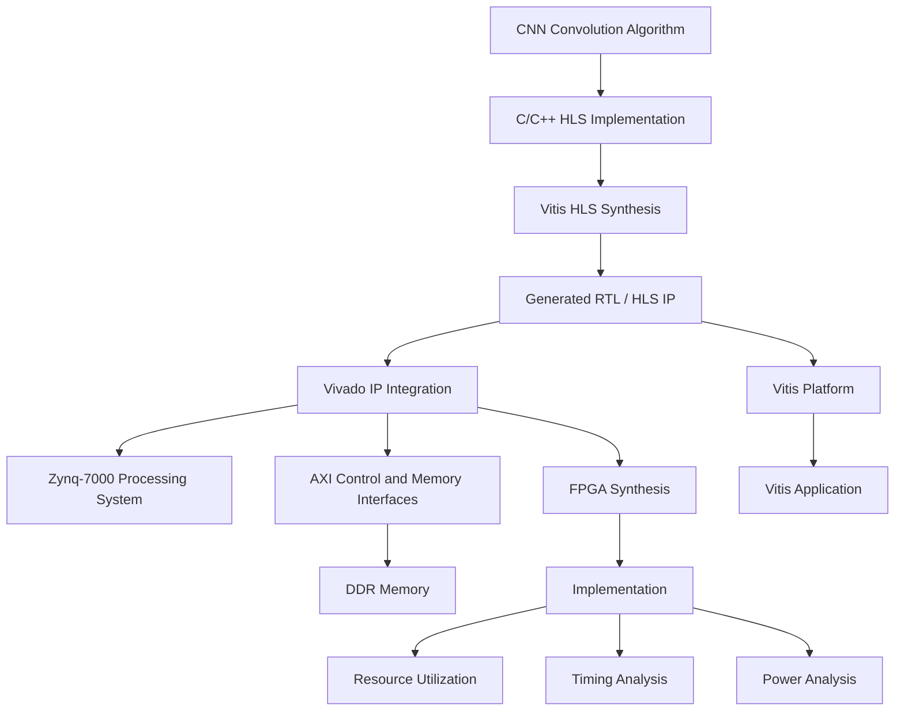
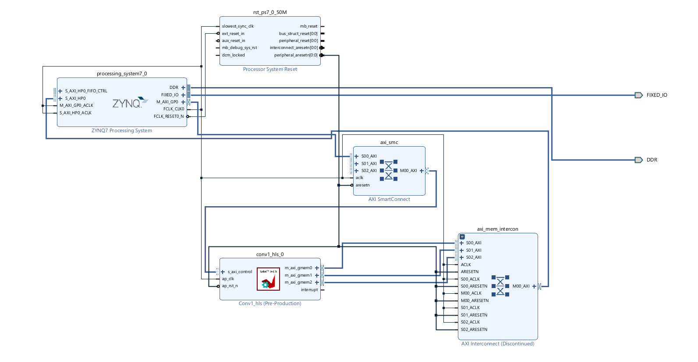
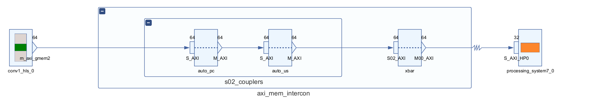
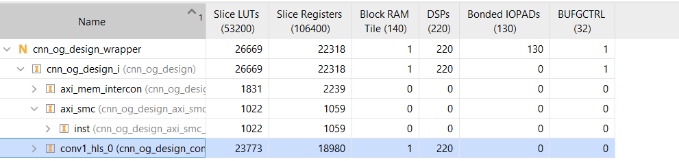
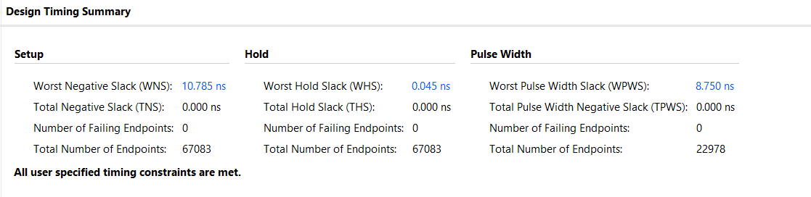
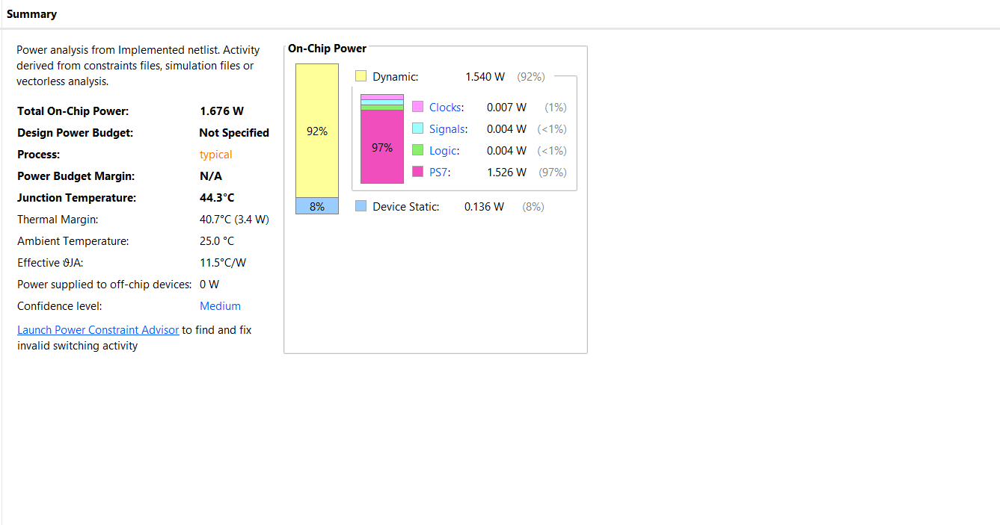

# Design and Implementation of a CNN Convolution Accelerator on Zynq-7000 FPGA Using High-Level Synthesis

## Overview

This project presents the design and FPGA implementation of a CNN convolution accelerator using AMD/Xilinx Vitis HLS and Vivado targeting a Zynq-7000 FPGA platform (`xc7z020clg400-1`).

The convolution computation is implemented in C and synthesized into RTL hardware using High-Level Synthesis (HLS). The generated HLS accelerator IP (`conv1_hls_0`) is integrated with the Zynq-7000 Processing System (`processing_system7_0`) through AXI4-Lite control and AXI4 Master memory interfaces (`m_axi_gmem0`, `m_axi_gmem1`, `m_axi_gmem2`).

The implemented design is evaluated using FPGA post-implementation resource utilization, post-implementation timing analysis, and Vivado power estimation. A Vitis software platform and ARM-side C application were generated and successfully built to verify hardware-software co-design flow.

> **Note on Evaluation Scope**: Physical FPGA-board execution, real-time sensor input streaming, physical hardware-measured power, and end-to-end multi-layer CNN inference have not yet been performed and are identified as future work.

---

## Problem Statement / Motivation

Convolutional Neural Networks (CNNs) require significant computational throughput due to the large volume of multiply-accumulate (MAC) operations present in feature extraction layers. Executing these operations on a general-purpose processor can impose severe computational load and high execution latency.

The objective of this project is to implement the first 2D convolution layer (`conv1_hls`) of a CNN as a dedicated hardware accelerator on an FPGA using High-Level Synthesis (HLS) and integrate it with the Zynq-7000 Processing System through high-bandwidth AXI interfaces.

The project focuses on:
1. Hardware accelerator algorithm design and C-based HLS synthesis.
2. IP packaging and AXI memory bus integration with the Zynq Processing System.
3. Post-implementation FPGA resource utilization, timing closure analysis, and Vivado power estimation.
4. Exporting the hardware configuration (`.xsa`) and building the ARM-side driver software in Vitis.

---

## Key Features

- **C-based CNN Convolution Accelerator**: Implements 2D convolution algorithm with configurable input, kernel, and output dimensions.
- **High-Level Synthesis (Vitis HLS)**: Algorithmic C description synthesized into optimized Verilog/VHDL RTL.
- **HLS Synthesis & RTL Generation**: Applied pipeline and loop unrolling directives (`#pragma HLS PIPELINE II=1`, `#pragma HLS UNROLL`).
- **Packaged HLS Accelerator IP**: Exported IP block with standardized AXI control and memory interfaces.
- **Zynq-7000 Processing System Integration**: Seamless memory-mapped interaction between ARM Cortex-A9 cores and the FPGA fabric.
- **AXI-based Control & Memory Interfaces**:
  - `s_axilite` (bundle `control`): Memory-mapped control and status registers.
  - `m_axi_gmem0`: Dedicated AXI Master interface for streaming input feature maps.
  - `m_axi_gmem1`: Dedicated AXI Master interface for fetching weights and biases.
  - `m_axi_gmem2`: Dedicated AXI Master interface for storing output feature maps.
- **AXI Infrastructure**: Interconnected via AXI SmartConnect (`axi_smc`) and AXI Memory Interconnect (`axi_mem_intercon`) to Zynq High-Performance (HP) slave ports.
- **DDR Memory Access**: Direct memory access to system DDR SDRAM for high-throughput data transfer.
- **Vivado FPGA Synthesis & Implementation**: Completed full synthesis, placement, and routing flow targeting Zynq-7000.
- **Post-Implementation Analysis**:
  - Resource Utilization (LUTs, FFs, BRAMs, DSPs).
  - Post-Implementation Timing Closure Analysis.
  - Vivado Power Estimation.
- **Vitis Software Co-Design**: Hardware platform (`.xsa`) exported to Vitis, generating board support package (BSP) and ARM application binary.

---

## Convolution Kernel Specification & Implementation Details

The core convolution kernel `conv1_hls` process parameters defined in [`Source_Code/conv1_hls.c`](Source_Code/conv1_hls.c) are summarized below:

| Parameter | Symbol | Value | Description |
| :--- | :--- | :--- | :--- |
| Input Height | `IN_H` | 64 | Input feature map height (pixels) |
| Input Width | `IN_W` | 64 | Input feature map width (pixels) |
| Input Channels | `IN_C` | 3 | Number of input channels (RGB) |
| Kernel Size | `K` | $3 \times 3$ | Convolution window dimensions |
| Output Channels | `OUT_C` | 16 | Number of output feature maps / filters |
| Output Height | `OUT_H` | 62 | `IN_H - K + 1` |
| Output Width | `OUT_W` | 62 | `IN_W - K + 1` |
| Input Data Type | `int8_t` | 8-bit Integer | Quantized input tensor (12,288 bytes) |
| Weight Data Type | `int8_t` | 8-bit Integer | Quantized weights tensor (432 bytes) |
| Bias Data Type | `int8_t` | 8-bit Integer | Quantized bias vector (16 bytes) |
| Output Data Type | `int32_t` | 32-bit Integer | Accumulator output tensor (61,504 words) |

### HLS Interface Pragma Configuration

```c
#pragma HLS INTERFACE m_axi port=input   offset=slave bundle=gmem0 depth=12288
#pragma HLS INTERFACE m_axi port=weights offset=slave bundle=gmem1 depth=432
#pragma HLS INTERFACE m_axi port=bias    offset=slave bundle=gmem1 depth=16
#pragma HLS INTERFACE m_axi port=output  offset=slave bundle=gmem2 depth=61504

#pragma HLS INTERFACE s_axilite port=input   bundle=control
#pragma HLS INTERFACE s_axilite port=weights bundle=control
#pragma HLS INTERFACE s_axilite port=bias    bundle=control
#pragma HLS INTERFACE s_axilite port=output  bundle=control
#pragma HLS INTERFACE s_axilite port=return  bundle=control
```

---

## Design Flow



---

## System Architecture

The Vivado block design integrates the Zynq-7000 Processing System (`processing_system7_0`) with the HLS-generated CNN accelerator (`conv1_hls_0`).

Key system components include:
- **`processing_system7_0`**: Dual ARM Cortex-A9 processor block managing system control, clock generation, and DDR memory controller.
- **`conv1_hls_0`**: Hardware accelerator IP implementing 2D convolution.
- **`axi_smc`**: AXI SmartConnect routing memory transactions.
- **`axi_mem_intercon`**: AXI Interconnect bridging memory master ports.
- **`DDR` & `FIXED_IO`**: System memory interfaces.

The accelerator provides three separate AXI Master memory bundles (`m_axi_gmem0`, `m_axi_gmem1`, `m_axi_gmem2`) to maximize concurrent read/write memory bandwidth over high-performance Zynq slave ports.


*Figure 1. Hardware Architecture of the Proposed CNN Accelerator on Zynq-7000 SoC*


*Figure 2. AXI Memory Interconnect for CNN Accelerator Memory Access*

---

## Repository Structure

```
CNN-ACCELERTAOR/
├── README.md                                # Project Documentation
├── Source_Code/
│   ├── conv1_hls.c                         # Core HLS C Kernel Implementation
│   ├── conv1_hlstb.c                       # HLS C Testbench for Simulation
│   ├── weights.c                           # Quantized Convolution Weights & Biases
│   └── weights.h                           # Weights Header File
├── Vivado/
│   ├── cnn_accelerator_architecture.png    # Top-Level Vivado IP Integrator Block Diagram
│   └── axi_memory_interconnect.png         # AXI Memory Interconnect Topology
├── Results/
│   ├── Resource_Utilization.png            # Post-Implementation FPGA Resource Usage
│   ├── Timing_Summary.png                  # Post-Implementation Timing Closure Summary
│   └── Report_Power.png                    # Vivado Post-Implementation Power Estimation
└── image_2026-09-04_232847702.png          # System Diagram / Synthesis Reference Image
```

---

## Implementation Results & Evaluation

The design was fully synthesized, placed, and routed using Xilinx Vivado targeting the Zynq-7000 FPGA family.

### 1. Resource Utilization

The post-implementation resource usage report detailing Lookup Tables (LUTs), Flip-Flops (FFs), Block RAMs (BRAMs), and DSP48E slices is shown below:


*Figure 3. Post-Implementation FPGA Resource Utilization Report*

### 2. Timing Closure Analysis

Post-implementation timing analysis confirms successful timing closure with positive Worst Negative Slack (WNS) and Worst Hold Slack (WHS):


*Figure 4. Post-Implementation Timing Summary Report*

### 3. Power Estimation

On-chip power consumption was analyzed post-implementation using Vivado Power Analysis tools:


*Figure 5. Vivado Post-Implementation Power Estimation Report*

> **Power Analysis Classification Note**: The reported power metrics represent Vivado post-implementation estimated on-chip thermal power based on switching activity models. Physical hardware power measurements using external power meters/shunts on a physical FPGA development board remain pending.

---

## System Integration & Software Flow

1. **HLS Synthesis**: Synthesized `conv1_hls.c` in Vitis HLS and exported packaged IP block.
2. **Vivado System Integration**: Integrated `conv1_hls_0` with `processing_system7_0`, AXI SmartConnect, and memory interconnects.
3. **Synthesis & Implementation**: Ran Vivado logic synthesis, placement, routing, and generated bitstream.
4. **Hardware Export**: Exported hardware definition file (`.xsa`).
5. **Vitis Software Development**: 
   - Created Vitis software platform targeting Zynq ARM Cortex-A9.
   - Built C application to initialize memory pointers, configure AXI-Lite control registers, start the hardware accelerator, and receive output data.

---

## Scope, Limitations & Future Work

### Current Accomplishments
- Successful C-to-RTL High-Level Synthesis of 2D CNN convolution kernel.
- AXI-Lite and multi-bundle AXI Master memory interface implementation.
- Complete Vivado SoC IP Integrator hardware design.
- Successful post-implementation synthesis, placement, routing, resource utilization analysis, timing closure, and power estimation.
- XSA hardware platform export and Vitis ARM application build.

### Current Limitations
- **Physical Hardware Deployment**: Testing on a physical Zynq-7000 development board has not yet been conducted.
- **Power Measurement**: Power metrics are Vivado synthesis/implementation estimates, not physical board multimeter/oscilloscope measurements.
- **End-to-End Inference**: Evaluated kernel covers Layer 1 (`conv1_hls`) convolution computation; full multi-layer CNN network pipeline is not currently deployed.

### Future Work
1. Program physical Zynq-7000 hardware board and validate end-to-end hardware execution.
2. Perform physical current/power measurement using board-level power rails.
3. Expand accelerator architecture to support multi-layer CNN topologies (pooling, activation, and fully-connected layers).
