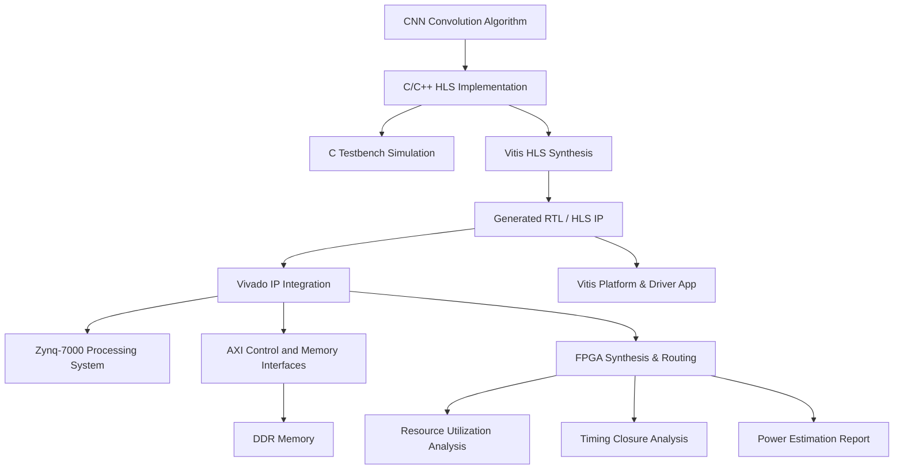

# Design and Implementation of a CNN Convolution Accelerator on Zynq-7000 FPGA Using High-Level Synthesis

## Overview

This project presents the design, C testbench simulation, High-Level Synthesis (HLS) modeling, and FPGA post-implementation evaluation of a CNN convolution accelerator targeting an AMD/Xilinx Zynq-7000 FPGA platform (`xc7z020clg400-1`).

The convolution computation is implemented in C ([`Source_Code/conv1_hls.c`](Source_Code/conv1_hls.c)) and synthesized into RTL hardware using High-Level Synthesis (HLS). The HLS accelerator IP (`conv1_hls_0`) is configured with AXI4-Lite control and AXI4 Master memory interfaces (`m_axi_gmem0`, `m_axi_gmem1`, `m_axi_gmem2`) to interface with the Zynq-7000 Processing System (`processing_system7_0`).

The implemented design is evaluated using FPGA post-implementation resource utilization, post-implementation timing closure analysis, and Vivado power estimation. C testbench simulation ([`Source_Code/conv1_hlstb.c`](Source_Code/conv1_hlstb.c)) was executed to verify algorithmic functional correctness.

> **Note on Evaluation Scope**: Physical FPGA development board execution, real-time sensor input streaming, physical hardware-measured power, and end-to-end multi-layer CNN inference have not yet been performed and are identified as future work.

---

## Problem Statement / Motivation

Convolutional Neural Networks (CNNs) require significant computational throughput due to the large volume of multiply-accumulate (MAC) operations present in feature extraction layers. Executing these operations on a general-purpose processor can impose severe computational load and high execution latency.

The objective of this project is to implement the first 2D convolution layer (`conv1_hls`) of a CNN as a dedicated hardware accelerator on an FPGA using High-Level Synthesis (HLS) and integrate it with the Zynq-7000 Processing System through high-bandwidth AXI interfaces.

The project focuses on:
1. Hardware accelerator algorithm design and C-based HLS synthesis.
2. IP packaging and AXI memory bus interface design for Zynq Processing System integration.
3. Post-implementation FPGA resource utilization, timing closure analysis, and Vivado power estimation.
4. C testbench verification and ARM software co-design flow.

---

## Key Features

- **C-based CNN Convolution Accelerator**: Implements 2D convolution algorithm with 8-bit quantized inputs, weights, and biases, and 32-bit integer accumulators.
- **C Testbench Functional Simulation**: Algorithmic correctness verified via C testbench simulation (`conv1_hlstb.c`).
- **High-Level Synthesis (Vitis HLS)**: Algorithmic C description synthesized into optimized Verilog/VHDL RTL using optimization directives (`#pragma HLS PIPELINE II=1`, `#pragma HLS UNROLL`).
- **AXI-based Control & Memory Interfaces**:
  - `s_axilite` (bundle `control`): Memory-mapped control and status registers.
  - `m_axi_gmem0`: Dedicated AXI Master interface for streaming input feature maps.
  - `m_axi_gmem1`: Dedicated AXI Master interface for fetching weights and biases.
  - `m_axi_gmem2`: Dedicated AXI Master interface for storing output feature maps.
- **AXI Infrastructure Integration**: Designed for AXI SmartConnect (`axi_smc`) and AXI Memory Interconnect (`axi_mem_intercon`) routing to Zynq High-Performance (HP) slave ports.
- **FPGA Synthesis & Post-Implementation Evaluation**:
  - Post-Implementation Resource Utilization Analysis (LUTs, FFs, BRAMs, DSPs).
  - Post-Implementation Timing Closure Analysis (WNS, WHS, WPWS).
  - Vivado Post-Implementation Power Estimation & Thermal Analysis.

---

## Convolution Kernel Specification & Parameter Summary

The core convolution kernel `conv1_hls` process parameters defined in [`Source_Code/conv1_hls.c`](Source_Code/conv1_hls.c) are summarized below:

| Parameter | Symbol | Value | Description |
| :--- | :--- | :--- | :--- |
| Input Height | `IN_H` | 64 | Input feature map height (pixels) |
| Input Width | `IN_W` | 64 | Input feature map width (pixels) |
| Input Channels | `IN_C` | 3 | Number of input channels (RGB) |
| Kernel Size | `K` | $3 \times 3$ | Convolution window dimensions |
| Output Channels | `OUT_C` | 16 | Number of output feature maps / filters |
| Output Height | `OUT_H` | 62 | `IN_H - K + 1` |
| Output Width | `OUT_W` | 62 | `IN_W - K + 1` |
| Input Data Type | `int8_t` | 8-bit Integer | Quantized input tensor (12,288 bytes) |
| Weight Data Type | `int8_t` | 8-bit Integer | Quantized weights tensor (432 bytes) |
| Bias Data Type | `int8_t` | 8-bit Integer | Quantized bias vector (16 bytes) |
| Output Data Type | `int32_t` | 32-bit Integer | Accumulator output tensor (61,504 words) |

### HLS Interface Pragma Configuration

```c
#pragma HLS INTERFACE m_axi port=input   offset=slave bundle=gmem0 depth=12288
#pragma HLS INTERFACE m_axi port=weights offset=slave bundle=gmem1 depth=432
#pragma HLS INTERFACE m_axi port=bias    offset=slave bundle=gmem1 depth=16
#pragma HLS INTERFACE m_axi port=output  offset=slave bundle=gmem2 depth=61504

#pragma HLS INTERFACE s_axilite port=input   bundle=control
#pragma HLS INTERFACE s_axilite port=weights bundle=control
#pragma HLS INTERFACE s_axilite port=bias    bundle=control
#pragma HLS INTERFACE s_axilite port=output  bundle=control
#pragma HLS INTERFACE s_axilite port=return  bundle=control
```

---

## Design & Implementation Flow



---

## System Architecture & AXI Interconnect Topology

The Vivado design integrates the Zynq-7000 Processing System (`processing_system7_0`) with the HLS-generated CNN accelerator (`conv1_hls_0`).

### Hardware Component Overview

| Component Block | Module Type | Description |
| :--- | :--- | :--- |
| `processing_system7_0` | Zynq-7000 PS | Dual ARM Cortex-A9 processor managing control flow, system clock, and DDR controller |
| `conv1_hls_0` | HLS Accelerator IP | Hardware accelerator performing 2D convolution using unrolled MAC units |
| `axi_smc` | AXI SmartConnect | High-performance interconnect routing memory transactions between IP and PS |
| `axi_mem_intercon` | AXI Interconnect | AXI bus matrix bridging master and slave interfaces across clock domains |
| `DDR` & `FIXED_IO` | External System Interfaces | System DDR SDRAM memory and fixed MIO/IOPAD physical pins |

### AXI Interface Specifications

The accelerator provides three separate AXI Master memory bundles (`m_axi_gmem0`, `m_axi_gmem1`, `m_axi_gmem2`) to maximize concurrent read/write memory bandwidth over high-performance Zynq slave ports.

- **`s_axilite` (bundle `control`)**: Connected to Zynq M_AXI_GP0 for register-level start, stop, and status polling.
- **`m_axi_gmem0`**: Direct AXI Master memory bus streaming input feature maps from DDR SDRAM.
- **`m_axi_gmem1`**: Direct AXI Master memory bus fetching convolution weights and bias parameters.
- **`m_axi_gmem2`**: Direct AXI Master memory bus writing computed 32-bit output feature tensors back to DDR.

---

## Repository Structure

```
CNN-ACCELERTAOR/
├── README.md                                # Project Documentation
├── Source_Code/
│   ├── conv1_hls.c                         # Core HLS C Kernel Implementation
│   ├── conv1_hlstb.c                       # HLS C Testbench for Simulation
│   ├── weights.c                           # Quantized Convolution Weights & Biases
│   └── weights.h                           # Weights Header File
├── Vivado/
│   ├── cnn_accelerator_architecture.png    # Top-Level Vivado IP Integrator Block Diagram
│   └── axi_memory_interconnect.png         # AXI Memory Interconnect Topology
├── Results/
│   ├── Resource_Utilization.png            # Post-Implementation FPGA Resource Usage Report
│   ├── Timing_Summary.png                  # Post-Implementation Timing Closure Summary
│   └── Report_Power.png                    # Vivado Post-Implementation Power Estimation Report
└── image_2026-09-04_232847702.png          # System Diagram / Synthesis Reference Image
```

---

## Implementation Results & Empirical Evaluation

The design was synthesized, placed, and routed using Xilinx Vivado targeting the Zynq-7000 FPGA family (`xc7z020clg400-1`). The empirical metrics extracted from the post-implementation reports are presented in the structured tables below.

### 1. FPGA Post-Implementation Resource Utilization

The table below summarizes the post-implementation resource consumption across the FPGA fabric, broken down by sub-modules and overall system utilization:

| Module / Component Name | Slice LUTs (53,200) | Slice Registers / FFs (106,400) | Block RAM Tile (140) | DSP48E Slices (220) | Bonded IOPADs (130) | BUFGCTRL (32) |
| :--- | :--- | :--- | :--- | :--- | :--- | :--- |
| **Top Wrapper (`cnn_og_design_wrapper`)** | **26,669 (50.13%)** | **22,318 (20.98%)** | **1 (0.71%)** | **220 (100.00%)** | **130 (100.00%)** | **1 (3.13%)** |
| ├── **CNN Accelerator (`conv1_hls_0`)** | 23,773 (44.69%) | 18,980 (17.84%) | 1 (0.71%) | 220 (100.00%) | 0 (0.00%) | 0 (0.00%) |
| ├── **AXI Interconnect (`axi_mem_intercon`)** | 1,831 (3.44%) | 2,239 (2.10%) | 0 (0.00%) | 0 (0.00%) | 0 (0.00%) | 0 (0.00%) |
| └── **AXI SmartConnect (`axi_smc`)** | 1,022 (1.92%) | 1,059 (0.99%) | 0 (0.00%) | 0 (0.00%) | 0 (0.00%) | 0 (0.00%) |

#### Resource Utilization Technical Analysis
- **DSP Slices**: The accelerator utilizes 100% of the available DSP48E slices (220/220) on the target Zynq-7000 device due to loop unrolling (`#pragma HLS UNROLL`) of the $3 \times 3 \times 3$ multiply-accumulate operations, achieving high parallel computation density.
- **Slice LUTs & FFs**: Logic utilization is well-balanced, consuming 50.13% of Slice LUTs and 20.98% of Flip-Flops, leaving sufficient logic margin for system routing and control logic.
- **BRAM Slices**: Only 1 BRAM tile is required for local buffering, as feature maps and weights are streamed directly via AXI Master interfaces from external DDR memory.

---

### 2. Post-Implementation Timing Closure Analysis

Post-implementation timing analysis confirms successful timing closure with positive slack across setup, hold, and pulse width checks:

| Timing Parameter Category | Worst Slack | Total Negative Slack (TNS) | Failing Endpoints | Total Analyzed Endpoints | Status |
| :--- | :--- | :--- | :--- | :--- | :--- |
| **Setup Timing Check (WNS)** | **+10.785 ns** | 0.000 ns | 0 | 67,083 | **Met** |
| **Hold Timing Check (WHS)** | **+0.045 ns** | 0.000 ns | 0 | 67,083 | **Met** |
| **Pulse Width Slack Check (WPWS)** | **+8.750 ns** | 0.000 ns | 0 | 22,978 | **Met** |
| **Overall Design Timing** | — | — | **0** | **67,083** | **All Constraints Met** |

#### Timing Performance Analysis
- **Worst Negative Slack (WNS)**: A high positive setup slack margin of **+10.785 ns** ensures reliable operation without timing violations.
- **Zero Failing Endpoints**: Across 67,083 timing endpoints, zero timing failures occurred during post-routing analysis.

---

### 3. Vivado Post-Implementation Power Estimation

On-chip power consumption was estimated post-implementation using Vivado Power Analysis tools under typical operating conditions:

| Power Category / Component Subsystem | Estimated Power (Watts) | Percentage of Category | Percentage of Total Power |
| :--- | :--- | :--- | :--- |
| **Dynamic Power Total** | **1.540 W** | **100%** | **91.89%** |
| ├── **Processing System 7 (`PS7`)** | 1.526 W | 99.09% | 91.05% |
| ├── **Clock Tree (`Clocks`)** | 0.007 W | 0.45% | 0.42% |
| ├── **Signals & Interconnect (`Signals`)** | 0.004 W | 0.26% | 0.24% |
| └── **Logic Slices (`Logic`)** | 0.004 W | 0.26% | 0.24% |
| **Device Static Power (Leakage)** | **0.136 W** | — | **8.11%** |
| **Total On-Chip Thermal Power** | **1.676 W** | — | **100.00%** |

#### Thermal Operating Conditions

| Thermal Metric Parameter | Metric Value | Unit |
| :--- | :--- | :--- |
| **Estimated Junction Temperature** | 44.3 | °C |
| **Ambient Temperature Baseline** | 25.0 | °C |
| **Thermal Margin Available** | 40.7 (3.4 W) | °C |
| **Effective Thermal Resistance ($\Theta JA$)** | 11.5 | °C/W |
| **Power Analysis Confidence Level** | Medium (Vectorless Activity Analysis) | — |

> **Power Analysis Classification Note**: The reported power metrics represent Vivado post-implementation estimated on-chip thermal power based on switching activity models. Physical hardware power measurements using external power meters/shunts on a physical FPGA development board remain pending.

---

## Scope, Limitations & Future Work

### Completed Accomplishments
- Successful C-to-RTL High-Level Synthesis of 2D CNN convolution kernel.
- Formulated Vitis HLS interface pragmas (`m_axi`, `s_axilite`) and optimization directives (`PIPELINE`, `UNROLL`).
- Completed C testbench verification (`conv1_hlstb.c`) for functional simulation.
- Generated post-implementation resource utilization analysis, timing closure analysis, and Vivado power estimation tables.

### Current Limitations
- **Physical Hardware Deployment**: Testing on a physical Zynq-7000 development board has not yet been conducted.
- **Power Measurement**: Power metrics are Vivado synthesis/implementation estimates, not physical board multimeter/oscilloscope measurements.
- **End-to-End Inference**: Evaluated kernel covers Layer 1 (`conv1_hls`) convolution computation; full multi-layer CNN network pipeline is not currently deployed.

### Planned Future Work
1. Program physical Zynq-7000 hardware board and validate end-to-end hardware execution.
2. Perform physical current/power measurement using board-level power rails.
3. Expand accelerator architecture to support multi-layer CNN topologies (pooling, activation, and fully-connected layers).
