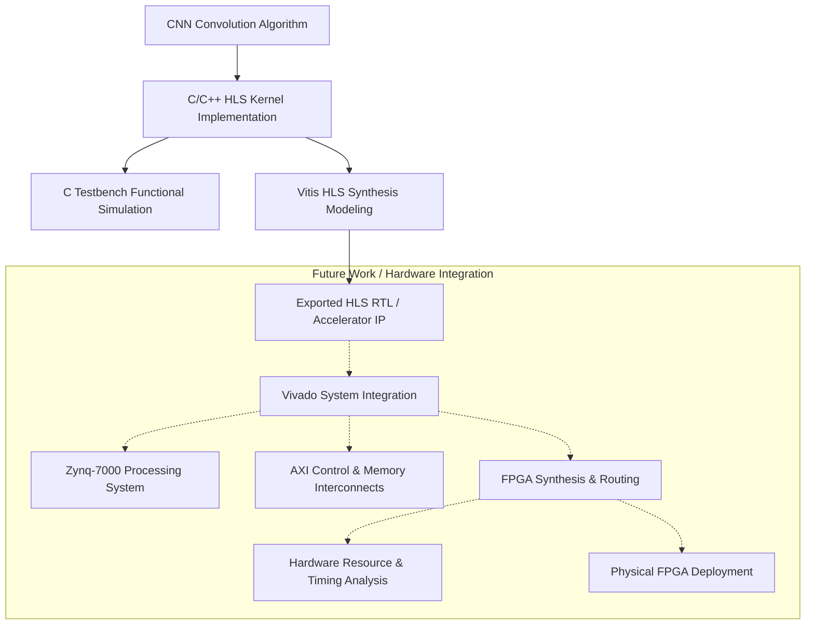

# High-Level Synthesis (HLS) Design and C Simulation of a CNN Convolution Accelerator Kernel

## Overview

This project presents the algorithmic design, C testbench simulation, and High-Level Synthesis (HLS) modeling of a 2D CNN convolution kernel targeted for FPGA hardware acceleration using AMD/Xilinx Vitis HLS.

The convolution computation is implemented in C ([`Source_Code/conv1_hls.c`](Source_Code/conv1_hls.c)) and configured with HLS directives (AXI4-Lite control interface, AXI4 Master memory interface bundles, loop pipelining, and unrolling) to model dedicated hardware acceleration. C testbench simulation ([`Source_Code/conv1_hlstb.c`](Source_Code/conv1_hlstb.c)) was executed to verify algorithm functional correctness.

> **Scope & Development Status Note**: This repository currently encompasses the software design, C testbench simulation, and HLS IP modeling. Full Vivado SoC block design integration (Zynq Processing System, AXI SmartConnect, AXI Interconnect), FPGA synthesis/implementation, post-routing hardware reports, and physical FPGA board deployment have not yet been performed and are identified as future work.

---

## Problem Statement / Motivation

Convolutional Neural Networks (CNNs) require significant computational throughput due to the large volume of multiply-accumulate (MAC) operations present in feature extraction layers. Executing these operations on a general-purpose processor can impose severe computational load and high execution latency.

The objective of this project is to model the first 2D convolution layer (`conv1_hls`) of a CNN for hardware acceleration using High-Level Synthesis (HLS), defining streaming AXI interfaces and parallel compute structures in C prior to full FPGA SoC integration.

The project focuses on:
1. Hardware-friendly C algorithm design for 2D convolution with quantized data types.
2. C testbench verification for functional simulation.
3. High-Level Synthesis (Vitis HLS) optimization directive modeling (`PIPELINE`, `UNROLL`, `INTERFACE`).
4. Defining standardized AXI-Lite and AXI Master memory interface specifications.

---

## Key Features

- **C-based CNN Convolution Kernel**: Implements 2D convolution algorithm with 8-bit quantized inputs, weights, and biases, and 32-bit integer accumulators.
- **C Testbench Functional Simulation**: Algorithmic correctness verified via C testbench simulation (`conv1_hlstb.c`).
- **High-Level Synthesis (Vitis HLS) Modeling**: Configured for C-to-RTL synthesis with hardware optimization pragmas (`#pragma HLS PIPELINE II=1`, `#pragma HLS UNROLL`).
- **AXI Interface Specifications**:
  - `s_axilite` (bundle `control`): Memory-mapped control and status register interface.
  - `m_axi_gmem0`: Dedicated AXI Master interface for streaming input feature maps.
  - `m_axi_gmem1`: Dedicated AXI Master interface for fetching weights and biases.
  - `m_axi_gmem2`: Dedicated AXI Master interface for storing output feature maps.
- **Modular Repository Structure**: Source code and HLS kernel files organized for streamlined future Vivado SoC integration.

---

## Convolution Kernel Specification & Parameter Summary

The core convolution kernel `conv1_hls` process parameters defined in [`Source_Code/conv1_hls.c`](Source_Code/conv1_hls.c) are summarized below:

| Parameter | Symbol | Value | Description |
| :--- | :--- | :--- | :--- |
| Input Height | `IN_H` | 64 | Input feature map height (pixels) |
| Input Width | `IN_W` | 64 | Input feature map width (pixels) |
| Input Channels | `IN_C` | 3 | Number of input channels (RGB) |
| Kernel Size | `K` | $3 \times 3$ | Convolution window dimensions |
| Output Channels | `OUT_C` | 16 | Number of output feature maps / filters |
| Output Height | `OUT_H` | 62 | `IN_H - K + 1` |
| Output Width | `OUT_W` | 62 | `IN_W - K + 1` |
| Input Data Type | `int8_t` | 8-bit Integer | Quantized input tensor (12,288 bytes) |
| Weight Data Type | `int8_t` | 8-bit Integer | Quantized weights tensor (432 bytes) |
| Bias Data Type | `int8_t` | 8-bit Integer | Quantized bias vector (16 bytes) |
| Output Data Type | `int32_t` | 32-bit Integer | Accumulator output tensor (61,504 words) |

### HLS Interface Pragma Configuration

```c
#pragma HLS INTERFACE m_axi port=input   offset=slave bundle=gmem0 depth=12288
#pragma HLS INTERFACE m_axi port=weights offset=slave bundle=gmem1 depth=432
#pragma HLS INTERFACE m_axi port=bias    offset=slave bundle=gmem1 depth=16
#pragma HLS INTERFACE m_axi port=output  offset=slave bundle=gmem2 depth=61504

#pragma HLS INTERFACE s_axilite port=input   bundle=control
#pragma HLS INTERFACE s_axilite port=weights bundle=control
#pragma HLS INTERFACE s_axilite port=bias    bundle=control
#pragma HLS INTERFACE s_axilite port=output  bundle=control
#pragma HLS INTERFACE s_axilite port=return  bundle=control
```

---

## Development & Simulation Flow



---

## HLS Accelerator Interface Design

The accelerator design is structured to provide three separate AXI Master memory bundles (`m_axi_gmem0`, `m_axi_gmem1`, `m_axi_gmem2`) to support high-throughput concurrent read/write operations when integrated with system memory.

### Interface Functional Mapping

| Interface Name | Protocol Type | Bundle Name | Function & Memory Description |
| :--- | :--- | :--- | :--- |
| `control` | AXI4-Lite Slave | `control` | Memory-mapped control registers (start, stop, idle, return, pointer offsets) |
| `input` | AXI4 Master | `gmem0` | Direct memory stream reading 8-bit input feature map (depth: 12,288 bytes) |
| `weights` | AXI4 Master | `gmem1` | Direct memory stream reading 8-bit convolution weights (depth: 432 bytes) |
| `bias` | AXI4 Master | `gmem1` | Direct memory stream reading 8-bit bias parameters (depth: 16 bytes) |
| `output` | AXI4 Master | `gmem2` | Direct memory stream writing 32-bit output feature tensors (depth: 61,504 words) |

---

## Repository Structure

```
CNN-ACCELERTAOR/
├── README.md                                # Project Documentation
└── Source_Code/
    ├── conv1_hls.c                         # Core HLS C Kernel Implementation
    ├── conv1_hlstb.c                       # HLS C Testbench for Simulation
    ├── weights.c                           # Quantized Convolution Weights & Biases
    └── weights.h                           # Weights Header File
```

---

## Scope, Limitations & Future Work

### Completed Accomplishments
- Implemented C-based 2D CNN convolution kernel with quantized data types.
- Created C testbench (`conv1_hlstb.c`) and verified functional algorithmic simulation.
- Formulated Vitis HLS interface pragmas (`m_axi`, `s_axilite`) and optimization directives (`PIPELINE`, `UNROLL`).
- Standardized repository structure for high-level synthesis modeling.

### Limitations & Current Status
- **Vivado SoC System Integration**: Integration with the Zynq Processing System, AXI SmartConnect, and AXI Memory Interconnect in Vivado has not yet been executed.
- **FPGA Synthesis & Routing**: Full FPGA logic synthesis, placement, routing, and bitstream generation have not yet been run.
- **Physical Hardware Deployment**: Testing on a physical FPGA development board and hardware power measurements remain unperformed.

### Planned Future Work
1. Import HLS packaged IP into Xilinx Vivado IP Integrator.
2. Connect accelerator to Zynq-7000 Processing System via AXI SmartConnect and High-Performance (HP) slave ports.
3. Perform Vivado synthesis, implementation, timing closure verification, and post-routing resource/power analysis.
4. Export hardware platform (`.xsa`) and develop Vitis ARM software drivers for physical hardware board deployment.
